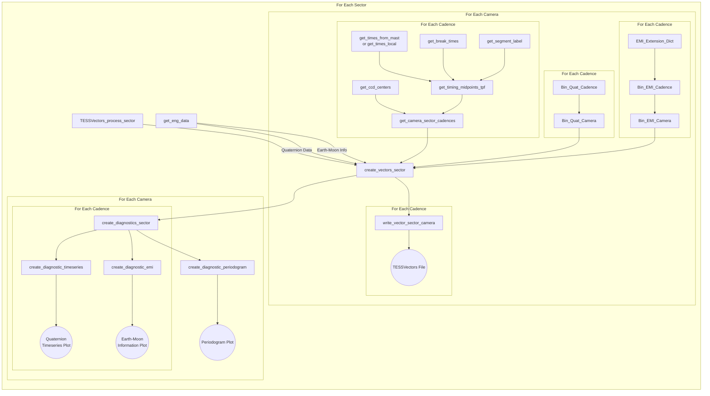

# TESSVectors 

# PRE-RELEASE 
version/changelog can go here

## A repository that takes Transiting Exoplanet Survey Satelitte (TESS) engineering data and transforms it into convenient value-added products for use in lightcurve detrending, image characterising, and more.   

### TESSVectors Introduction

The TESS-Vectors repository is an effort to take TESS mission engineering products and translate them into a more convenient, value-added form factor that is convenient for use by end-users.  

The information contained inside of these files is:

    - Cadence #: Cadence index from the source tpf
    - MidTime: The exposure midpoint in spacecraft time (i.e. tpf.time - tpf.timecorr)
    - TimeCorr: The Time Correction for spacecraft to Barycentric time at that cadence
    - ExpTime: The final cadence binning (20s/120s/FFI)
    - Sector: The TESS observing Sector for the source data
    - Camera: The TESS camera for the source data
    - Quat_Start: The timestamp of the earliest quaternion used in the bin
    - Quat_Stop: The timestamp of the last quaternion used in the bin
    - Quat_MIN_FOM: The worst Figure of Merit from the source quaternions
    - Quat_MIN_NUM_GSUSED: The lowest number of guide stars used in the source quaternions
    - Quat_NBinned: The number of quaternions binned into this final result.
    - Quat[1-4]_Med: The Quaternion #[1-4] median value from the binned values 
    - Quat[1-4]_StdDev: The standard deviation of Quaternion #[1-4] binned values
    - Quat[1-4]_SigClip: The Sigma-Clipped Standard Deviation of Quaternion #[1-4] binned values
    - Earth_Distance: Distance to Earth in Earth Radii
    - Earth_Camera_Angle: Angle of Earth from Camera Boresight in Degrees
    - Earth_Camera_Azimuth: Azimuth of Earth around Camera Boresight in Degrees
    - Moon_Distance: Distance to Moon in Earth Radii
    - Moon_Camera_Angle: Angle of Moon from Camera Boresight in Degrees
    - Moon_Camera_Azimuth: Azimuth of Moon around Camera Boresight in Degrees
    - (FFI Cadences Only) FFIFile: The FFI file assosciated with this observing cadence 

The information contained in these files generally comes from quaternion (\*-quat.fits) and earth-moon information (\*-emi.fits) [engineering files](https://archive.stsci.edu/missions-and-data/tess/data-products.html#mod_eng) that have been reprocessed to present results at the same time-cadence/binning as end usser TPFs'/lightcurves.

There is one TESS-Vectors file for every Cadence(20-second/120-second/FFI) and Camera/Sector.  We have also created some diagnostic plots to help guide the understanding of TESS observations for a given sector.  

### TESSVectors Usage

We expect that the most common usage for this code will be to create data products and diagnostics for a future sector. This can be done simply by using the TESSVectors_process_sector function, e.g. :

    TESSVectors_process_sector(Sector_Number)

Which calls the `create_vectors_sector` function that creates the TESSVectors CSV files for a given sector and the `create_diagnostics_sector` function that creates the diagnostic plots for a given sector.  

There are also some convenient multiprocessing functions if you wish to create a bulk reprocessing of the TESSVectors data - `run_bulk_vectors`, `run_bulk_processing`, and`run_bulk_diagnostics` which create all products, data files, and diagnostic plots respectively.  

TESSVectors has been optimized to minimize its reliance and repeated calls to external data.  From a high level perspective, this means that the default processing has been designed around creating TESSVectors for a given sector and accross all Cameras and Cadences at once.  The overall workflow for TESSVectors work

#### TESSVectors Config File
TESSVectors requires certain pieces of information to be run successfully.  High level, these are:

    - Are we using local or remote data?
    - Where will the output TESSVectors files go?
    - Where will the output TESSVectors diagnostic plots go?

These are managed through a configuration file (TESSVectors-Config.dat)

#### Local vs Remote Usage
TESSVectors requires access to certain files to create its end products for a given sector. These files are:
    
    - Sector Quaternion Files: *-quat.fits
    - Sector Earth-Moon Information Files: *-emi.fits
    - 1 tpf for each TESS observing cadence for each camera: (20s where available, 120s, FFI)
    
By default this information is retrieved from remote sources using API calls to mast holdings, and through the [lightkurve](https://docs.lightkurve.org) package.  

TESSVectors was initially designed and the initial products were made using remote data accessed from the MAST web holdings. We reccomend this. However, TESSVectors *also* has a somewhat experimental 'local' mode in the event that one is running these files where a sufficient archive of local data exists.   

The local access functions broadly assumes that all of your tpfs for a given TESS observing cadence are in a single folder.  If they are not (which is a sensible choice), *you may need to modify the local access functions to account for your local data directory structure*. For the FFI files, TESSVectors will attempt to use the list of FFI files as a TESSCut stand-in and create the nescessary products from these files.  That means that if any FFI files are missing from this list, TESSVectors will exclude those FFI times from the end products. 

The TESSVectors-Config.dat file manages the default processing method and the paths for the local data.  

### TESSVectors Data Usage Notes
While we have endeavoured to make these files as simple and straightforward to use as possible, there are a few points of note that one should keep in mind when using these files: 

    - MidTime: TESSVectors data products are created on a per-camera basis as that is the referance frame for the engineering files, however the CCD readouts can have small variations (<1s between CCD's 1-4) and so may not line up exactly with these values.  The cadence numbers should align with cadence numbers from mission TPFs and can be used to cross-index data as well. Currently CCD 1 for all cameras is being used as a benchmark.   
    
### Credits

Initial development done by [Tyler Pritchard](https://github.com/tylerapritchard), [Christina Hedges](https://github.com/christinahedges) the [TESS Science Support Center](https://heasarc.gsfc.nasa.gov/docs/tess/), and the [MIT TESS Science Operations Team](https://tess.mit.edu/). 

### TESSVectors Code Workflow
[]

