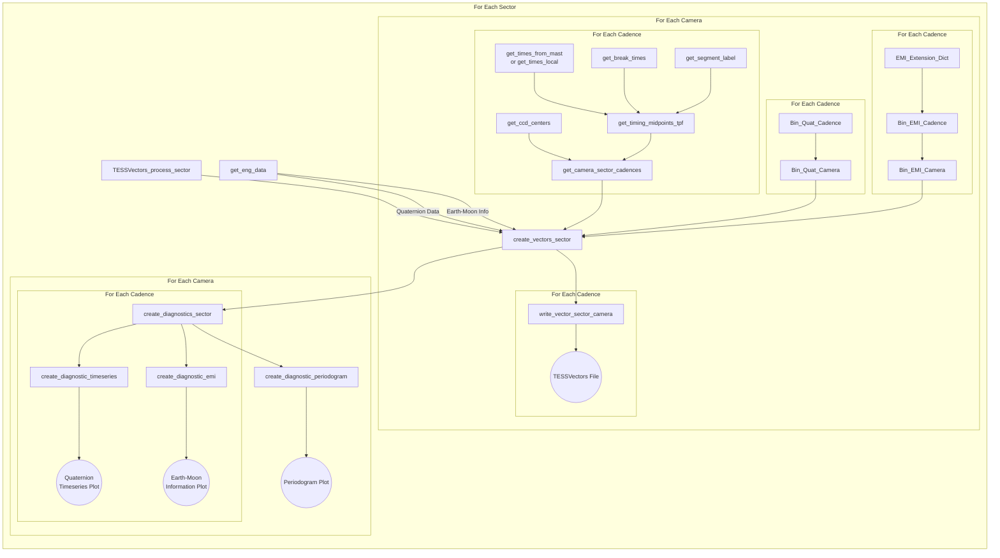

# tessvectors processing
The `tessvectors.processing` classes `makevectors` and `diagnostics` containg the functionality that created the tessvectors products.  
    - The `makevectors` class contains the processing workflow that creates each CSV
    - The `diagnostics` class contains the plotting & visualisation routines

# basic tessvectors processing
`tessvectors` was developed to use web-based TESS data hosted on MAST.  Basic creation of vectors for a sector can be created by running:

```
from tessvectors.processing import makevectors
makevectors().create_vectors_sector(1, check_exists=True)
```

This will create all tessvectors files for a given sector (020/120/FFI Cadences & Cameras 1/2/3/4).  If check_exists = True (default), it  will prevent TESSVectors from overwriting files

Diagnostic plots for a given sector can be created similarily

```
from tessvectors.processing import diagnostics
diagnostics.create_diagnostics_sector(1):
```

There also exist a few convenience functions in tessvectors - process_sector, run_bulk_vectors and run_bulk_diagnostics.  

    - process sector will create vectors and diagnostic plots for a given sector
    - run_bulk_vectors & run_bulk_diagnostics will use multiprocessing.Pool multiprocessing to run a large number of sectors at a time

### tessvectors processing usage

We expect that the most common usage for this code will be to create data products and diagnostics for a future sector. This can be done simply by using the TESSVectors_process_sector function, e.g. :
```
    import tessvectors
    tessvectors.process_sector(Sector_Number)
```

Which calls the `tessvectors.processing.makevectors.create_vectors_sector` function that creates the TESSVectors CSV files for a given sector and the `create_diagnostics_sector` function that creates the diagnostic plots for a given sector.  

There are also some convenient multiprocessing functions if you wish to create a bulk reprocessing of the TESSVectors data - `run_bulk_vectors`, `run_bulk_processing`, and`run_bulk_diagnostics` which create all products, data files, and diagnostic plots respectively.  

TESSVectors has been optimized to minimize its reliance and repeated calls to external data.  From a high level perspective, this means that the default processing has been designed around creating TESSVectors for a given sector and accross all Cameras and Cadences at once.  

#### Local vs Remote Usage
TESSVectors requires access to certain files to create its end products for a given sector. These files are:
    
    - Sector Quaternion Files: *-quat.fits
    - Sector Earth-Moon Information Files: *-emi.fits
    - 1 tpf for each TESS observing cadence for each camera: (20s where available, 120s, FFI)
    
By default this information is retrieved from remote sources using API calls to mast holdings, and through the [lightkurve](https://docs.lightkurve.org) package.  

TESSVectors was initially designed and the initial products were made using remote data accessed from the MAST web holdings. We reccomend this. However, TESSVectors *also* has a somewhat experimental 'local' mode in the event that one is running these files where a sufficient archive of local data exists.   

The local access functions broadly assumes that all of your tpfs for a given TESS observing cadence are in a single folder.  If they are not (which is a sensible choice), *you may need to modify the local access functions to account for your local data directory structure*. For the FFI files, TESSVectors will attempt to use the list of FFI files as a TESSCut stand-in and create the nescessary products from these files.  That means that if any FFI files are missing from this list, TESSVectors will exclude those FFI times from the end products. 

This method is experimental and may require development/tweaking if you wish to use purely local files.  

### TESSVectors Code Workflow

